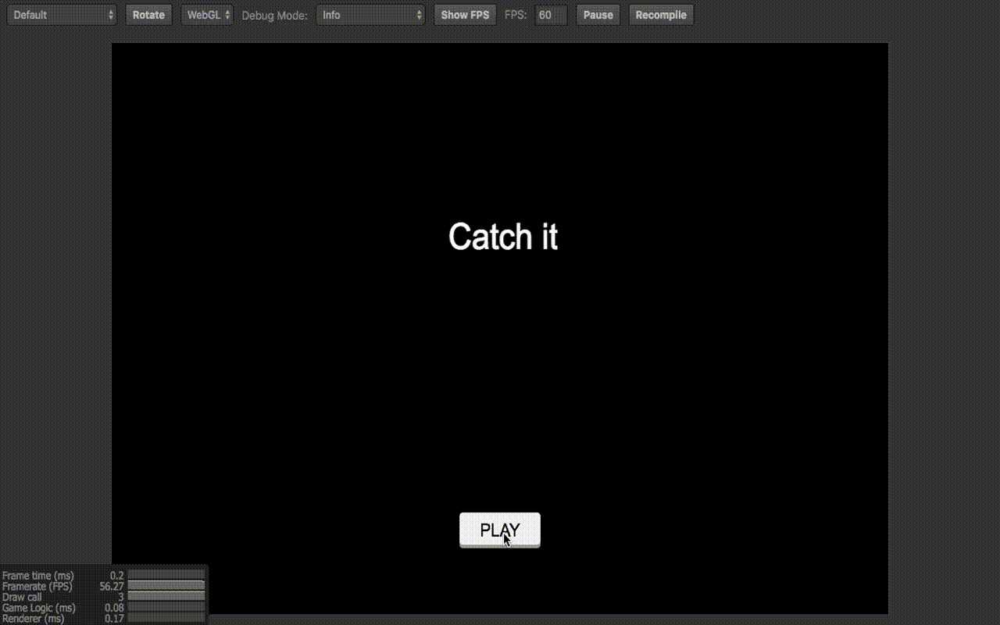
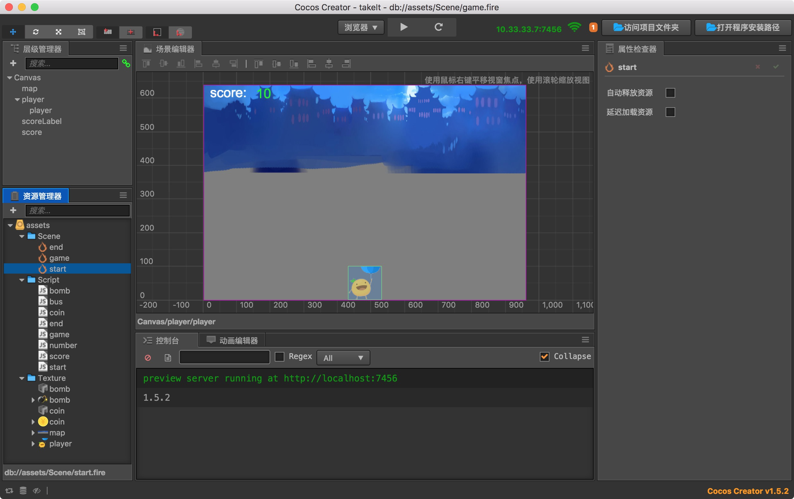

# cocos creater做的接金币小游戏
#### 游戏截图：
[试玩地址](140.143.155.241)

## 简介 游戏主要分为三个场景
### start（点击按钮进入游戏）
### game（接到炸弹后游戏结束，接到金币分数增加）
### end（分数统计，点击retry重新开始游戏）

#### 实现思路：
游戏中用到的Prefab是炸弹和金币，他们随机从上往下掉。然后使用碰撞系统，如果和人物发生碰撞，做出相应的处理。

#### 游戏方法：
通过键盘的左右或者A、D按键来控制小人的移动。接到金币加10分，接到炸弹游戏结束。  
只支持在pc上玩，因为这里监听的是键盘事件，分别监听了键盘的A和D，已经方向键左和右，keycode分别是65(A）、68(D)、37(左)、39(右)。

#### 程序截图：

